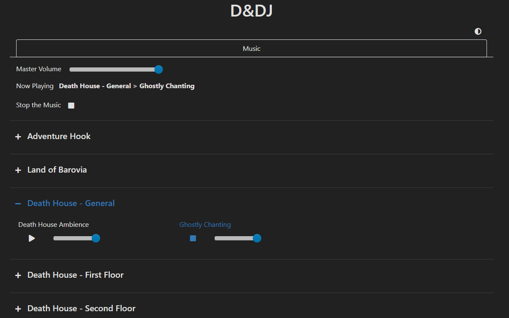
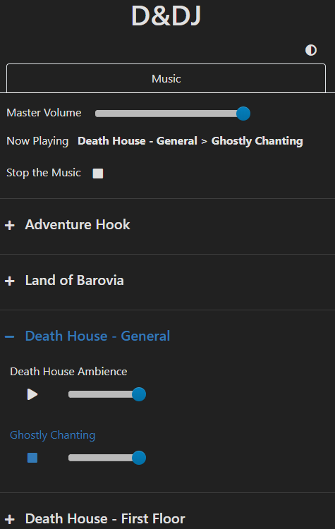

# D&DJ (Discord version)

*D&DJ* was created to help dungeon masters incorporate music into their storytelling. 
The idea is to prepare the music you want to use for specific scenes in advance and then being 
able to play them without any issues.

*For the regular version [click here](https://github.com/janbrrr/dndj).*

### Overview

- Prepare a configuration file defining the music you want to use
- Music
  - Supports MP3 files and links to YouTube videos
  - Supports next, start_at, end_at and individual volume parameters
  - One only piece of music can be played at a time
- Start the Discord bot and join a voice channel
- Start the web server with the config via the ``!start`` bot command
  - The server downloads the YouTube videos if necessary
  - The server controls the media player and discord voice client
- Visit the hosted web page from a device in the same network (e.g., computer, phone)
  - The web page displays the available music (as specified in the config)
  - Play music, stop the music or change the volume

Desktop View            |  Mobile
:-------------------------:|:-------------------------:
  |  


### How does it work under the hood?

The bot is based on [discord.py](https://discordpy.readthedocs.io/en/latest/) and the bot hosts a server based on
[aiohttp](https://github.com/aio-libs/aiohttp/). 
Clients can connect to the server via the hosted web page and they then connect via websockets. 
Every connected client will always know what music is currently being played, what the volume is and 
will be notified when a change occurs.

The web page shows the clients the preconfigured music that is available and allows them to request to
play a music track, stop the music or change the volume. The server will receive these requests
and fulfill them using [discord.py](https://discordpy.readthedocs.io/en/latest/) and [FFmpeg](https://ffmpeg.org/)
to play the music over the discord voice channel.

# Table Of Contents
- [Getting Started](#getting-started)
  - [Requirements & Installation](#requirements-and-installation)
  - [Registering the Bot](#bot-registration)
  - [Running the Example](#example)
- [User Guide](#guide)
  - [Bot Commands](#commands)
  - [Configuring the Music](#guide-config)
  - [Accessing the Web Page from a different Device](#guide-access)
  - [Words of Advice](#guide-advice)
- [Resource Recommendations](#resources)
  - [Music & Ambience](#resources-music)

# <a name="getting-started"/>Getting Started

## <a name="requirements-and-installation"/>Requirements & Installation

First, you need to have [Python](https://www.python.org/) installed, version 3.7.

Next, set up a virtual environment.
1. Change the directory to this project's root and type `python -m venv venv` to create a virtual environment named `venv`
2. Activate the virtual environment (`(venv)` should appear before the directory)
    1. On Windows: `venv\Scripts\activate`
    2. On Linux: `source venv/bin/activate`
3. Install the requirements with `pip install -r requirements.txt`
    1. Use the `requirements-dev.txt` if you are a developer and run `pre-commit install`.

Whenever you want to execute the program from the terminal, make sure the virtual environment is active.

Additionally, you have to install [FFmpeg](https://ffmpeg.org/) as this is the audio player `discord.py` supports. 
Make sure to add the `/bin` folder of FFmpeg to your `PATH` on Windows.

## <a name="bot-registration"/>Registering the Bot

Before you can run the bot, you need to register the bot.

Visit the [Discord developer portal](https://discord.com/developers/applications) and create a new application.
Click on the `Bot` section on the left sidebar and add a new bot. 
Click the `Reveal token` button below the username of the bot and create a new file named `token.txt` in the root folder
of the project that contains this token.

Now click on the `OAuth2` section. Check the `bot` scope and give the bot the following permissions:
`View Channels`, `Connect` and `Speak`. Finally, use the generated invite link to add the bot to your discord server.

## <a name="example"/>Running the Example

Run the example by typing `python start_bot.py "examples/death_house/config.yaml"`.
Make sure to join a voice channel in discord and type `!start` in a channel that the bot can see to start the server
(type `!stop` to stop it).
The bot will now join your voice channel and download the music from YouTube.

Note that you may need to clear the cache directory (`/.dndj_cache`/) if disk space becomes an issue.
You can use the `!clear` bot command to delete all downloads.

Now you can visit `127.0.0.1:8080` in your browser and start playing around. It is an example configuration for running (a variation of) 
[Death House](https://media.wizards.com/2016/downloads/DND/Curse%20of%20Strahd%20Introductory%20Adventure.pdf).
You can start music by clicking the play button and the bot will play it through voice in discord.

# <a name="guide"/>User Guide

## <a name="commands"/>Bot Commands

- `!stop` starts the server and the bot joints your voice channel
- `!stop` stops the server and the bot leaves your voice channel
- `!clear` deletes the downloaded files

## <a name="guide-config"/>Configuring the Music

The configuration file is a `YAML` file. It contains the music configuration.

```yaml
music:
  # content ...
```

### Music

The music configuration is divided into a hierarchical structure.

At the root is the `music` element that defines at least the master `volume`
and a list of `groups` that will be used.

```yaml
### music > root config ###
music:
  volume: 20              # master value from 0 (mute) to 100 (max)
  directory: path/to/dir  # (Optional) used if all files are in the same dir
  sort: true              # (Optional, default=true) whether to sort the groups alphabetically
  groups: []              # a list of groups
```

A `group` can for example be a scene in the story. It has a `name` and defines a collection
of `track_lists` (i.e., playlists).

```yaml
### music > group config ###
music:
  # ...
  groups:
  - name: Scene 1 - Travel
    directory: path/to/dir  # (Optional) used if all files of a group are in the same dir
    sort: true              # (Optional, default=true) whether to sort the tracklists alphabetically
    track_lists: []         # a list of tracklists
  - name: Scene 2 - Arrival
    # ...
```

A `track_list` also has at least a `name` and defines a collection of `tracks` that
it will play.

```yaml
### music > track_list config ###
music:
  # ...
  groups:
  - name: Scene 1 - Travel
    # ...
    track_lists:
    - name: Spooky Music
      directory: path/to/dir  # (Optional) used if all files of a tracklist are in the same dir
      volume: 50              # (Optional, default=100) volume for this tracklist where 0 is mute and 100 is max
      loop: true              # (Optional, default=true) whether to loop if all tracks have been played
      shuffle: true           # (Optional, default=true) whether to shuffle the tracks before playing them all
      next: Forest Ambience   # (Optional) name of the next tracklist to play
      tracks: []              # a list of tracks
```

Finally, a `track` refers to a music file or YouTube link. In the simplest case it is only a filename (link),
but you can further configure it. Every file type that the VLC media player supports should work.

Keep in mind that streaming the audio from YouTube will introduce a delay of a second or two to build up the
connection etc.
```yaml
### music > track config ###
music:
  # ...
  groups:
  - name: Scene 1 - Travel
    # ...
    track_lists:
    - name: Forest Ambience
      # ...
      tracks:
      - forest_ambience_1.mp3                          # can either be a filename
      - https://www.youtube.com/watch?v=HAw37tUHcOo    # or a YouTube video
      - file: forest_ambience_2.mp3                    # or more specific (`file` can be a filename or link)
        start_at: 0:0:10  # (Optional) the format is %H:%M:%S
        end_at: 0:0:20    # (Optional) the format is %H:%M:%S
```

## <a name="guide-access"/>Accessing the Web Page from a different Device

If you want to access the web page from a different device, e.g., your phone, you have to look up the IP address of
the host computer and host the server on this IP address.

On Windows you can open the command line and enter `ipconfig` as command to view your IPv4 address.
On Linux you can use `ifconfig`. For simplicity, assume your IP address is 192.168.1.1 in the following.

Run the `start_bot.py` script as follows: `python start_bot.py --host "192.168.1.1" "path/to/config.yaml"`

Now you can visit the url `192.168.1.1:8080` from any device that is in the same network as the host computer.

## <a name="guide-advice"/>Words of Advice

Here is a bit of advice I would give. You may agree or disagree with it, see what works for you.

### Use Music to Emphasize

The first point is to not overuse music. Use music to emphasize special situations and changes in the atmosphere.
By that I mean to play a *single* track that fits, not a whole playlist. By doing so the music feels much more impactful
when it plays.

For example, when the party meets the villain for the first time, you can play some dark super villain music 
(maybe even give the villain his own soundtrack). Or when something sad happens or a sad story is being told, 
emphasize the sadness by underlying it with sad music. Keep in mind that the music is not the focus and should be
quiet enough to not disturb while talking. Also, use music without any vocals since they will be distracting.

Think you of the situations you expect to arise in your story and how you can use music to emphasize some of them.

### Use Ambience as Background Music

Second, I recommend to use *ambience* as default background "music" instead of using music. 

For example, when the party is in a forest, play some forest ambience to set the scene
and make the journey more immersive.
When the party enters a tavern, switch to tavern ambience.

As the DM you will know the locations that will appear in your story, so you can prepare appropiate ambience
for them.

# <a name="resources"/>Resource Recommendations

## <a name="resources-music"/>Music & Ambience

Here is small collection of sources where you can discover great music.

- [Adrian von Ziegler](https://www.youtube.com/channel/UCSeJA6az0GrNM4_-pl3HQSQ) (Fantasy Music)

- [BrunuhVille](https://www.youtube.com/user/BrunuhVille/) (Fantasy Music)

- [Derek & Brandon Fiechter](https://www.youtube.com/channel/UCjMZjGhrFq_4llVS_x2XJ_w/) (Fantasy Music)

- [Lukas King](https://www.youtube.com/user/LucasKingPiano/featured) (Piano Music)

- [Michael Ghelfi](https://www.youtube.com/user/MichaelGhelfi) (Fantasy Music and Ambience)

- [Peter Crowley's Fantasy Dream](https://www.youtube.com/user/PeterCrowley83/) (Fantasy Music)

- [Peter Grundy](https://www.youtube.com/user/23Alchemist23/featured) (Fantasy Music)

- [Secession Studios](https://www.youtube.com/user/thesecession/) (Cinematic Music)

- [Sword Coast Soundscapes](https://www.youtube.com/channel/UCUGy8GD5oY4EX9awX4FSqBw/featured) (Ambience, Campaign-Specific Ambience)

- [Tabletop Audio](https://tabletopaudio.com/) (Music and Ambience)

- [Vindsvept](https://www.youtube.com/channel/UCfSUheoljDlGDjerRylO4Nw) (Fantasy Music)
